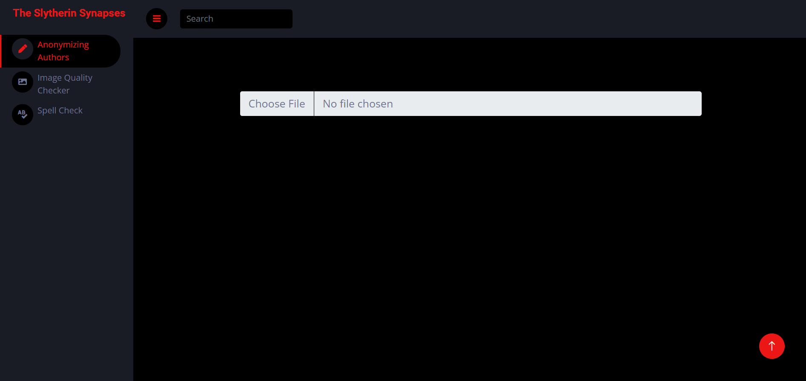
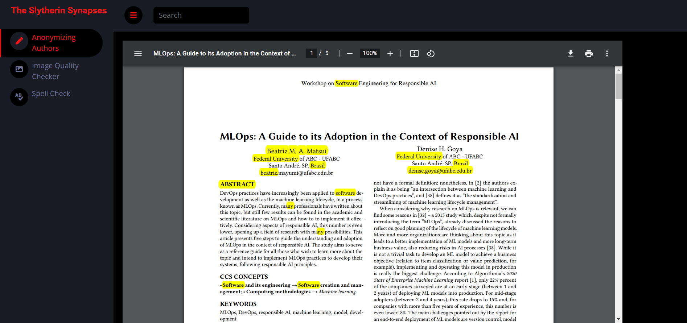

<h1>Our code is temporarily available on Drive!!!</h1>
<h1>Mined_Hackathon</h1>
<h2>Reducing desk rejections for researchers (CACTUS).</h2>
<h2>Team name : Slytherin Synapsis</h2>

**Sponsor** : CACTUS (Paperpal)<br>

**Track Number** : 1<br>


* Many times, researchers get their manuscripts rejected due to the failure of many minor and significant checks, and nearly 30 to 40% get rejected outright even before it is sent for review by peers.
<br>
* Our project helps the researchers get their manuscripts checked which reduces the chances of manuscripts getting rejected before it is sent for review by peers.<br>
<h3>Features</h3>

- [Anonymizing Authors](https://linktodocumentation)
- [AI generated content checker](https://linktodocumentation)
- [Image Quality Checker](https://linktodocumentation)
- [Spell Checker](https://linktodocumentation)
- [Retracted Papers in References](https://linktodocumentation)


<h3>Documentation</h3>

[Documentation](https://drive.google.com/file/d/1jo66Q4nRzDkRkaLI2hnbtSdnA8Z-7xqj/view?usp=sharing)


<h3>Installation</h3>

Install required dependencies

```bash
  pip install -r requirements.txt
```

Run api

```bash
  python main.py
```


<h3>Screenshots</h3>





<h3>Authors</h3>

- [@BhargavModha](https://www.github.com/bhargav-modha)
- [@AkshayPatel](https://www.github.com/akshaypatel67)
- [@AlokSinhChudasama](https://www.github.com/alok-chudasama)
- [@ShashankChaudhary](https://www.github.com/shashank-2610)
- [@DhyeyBhalani](https://www.github.com/dhyeybhalani)
